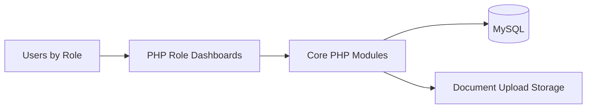

# TeamSphere - Collaborative Workspace Platform

[](./LICENSE)
[](#tech-stack)
[](#)

TeamSphere is a multi-role collaboration platform for teams, managers, and admins to coordinate tasks, reports, documents, and department workflows.

## Problem Statement

Internal team operations are often split across disconnected tools, reducing visibility and slowing execution. Organizations need a single, role-aware workspace for planning, reporting, and team coordination.

## Solution Overview

TeamSphere provides:
- role-based portals (admin/manager/employee)
- task and report workflows
- team and department management
- document handling and dashboard views

## Architecture



## Tech Stack

- **Frontend**: PHP-rendered dashboards + CSS/JS
- **Backend**: Core PHP modules
- **Database**: MySQL via PDO
- **Runtime**: XAMPP / Apache + PHP + MySQL

## Features

- Role-based authentication and dashboard access
- Manager/team/department workflows
- Admin user and system controls
- Document upload and retrieval paths
- Reporting views for operational visibility

## Project Structure

```text
teamsphere/
  index.php
  config.php
  includes/
    db_connect.php
    functions.php
  src/
    auth/
    admin/
    manager/
    employee/
  dashboard/
    dashboard.php
  docs/
    schema.sql
    DEPLOYMENT.md
    API.md
    SECURITY.md
  tests/
    README.md
```

## Screenshots

Add screenshots in `docs/screenshots/`:
- `home.png`
- `admin-dashboard.png`
- `manager-dashboard.png`
- `employee-dashboard.png`

## Demo

- **Live URL**: `https://<your-demo-url>`
- **Demo GIF**: `docs/screenshots/demo.gif`

## Installation

1. Clone repository.
2. Copy `.env.example` to `.env` and configure values.
3. Import `docs/schema.sql`.
4. Start Apache/MySQL in XAMPP.
5. Open `http://localhost/teamsphere`.

## Usage

1. Login from auth module.
2. Access role dashboard.
3. Manage tasks/reports/documents based on permissions.

## API / Integration Notes

TeamSphere is currently server-rendered PHP with internal module functions.

## Deployment Plan

Fastest path:
- PHP app on **Railway** or **Render**
- managed MySQL

Steps: [docs/DEPLOYMENT.md](./docs/DEPLOYMENT.md)

## Security Notes

See [docs/SECURITY.md](./docs/SECURITY.md) for hardening checklist.

## Future Improvements

- Add service layer boundaries for role modules.
- Add integration tests for role permissions.
- Add audit logging and observability.
- Add upload malware scanning and stricter MIME enforcement.

## Contributing

See [CONTRIBUTING.md](./CONTRIBUTING.md).

## License

MIT License - see [LICENSE](./LICENSE).
